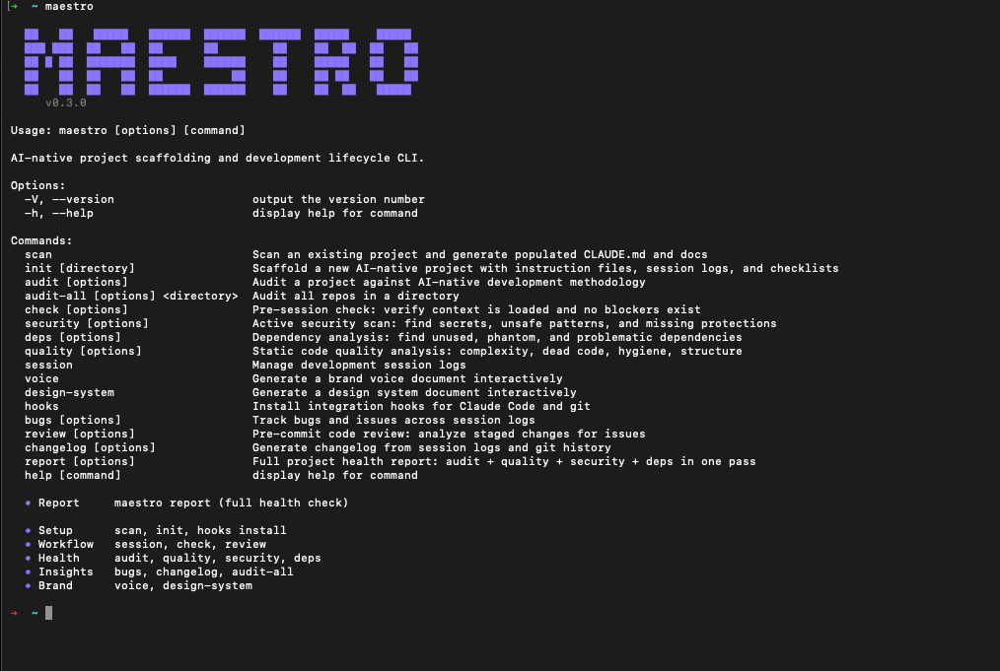

# Maestro

AI-native development fails without process. Not because the tools are bad, but because the tools are fast -- fast enough to produce a bigger pile of undirected output than any human can review.

Maestro is a CLI that scaffolds the process. It generates the instruction files, session logs, brand voice documents, design systems, and security checklists that keep AI-assisted development coherent across sessions, repos, and teams.

Created by [@shainapauley](https://shainapauley.com).



## Install

```bash
npm install -g maestro-dev
```

## Get Started

```bash
cd your-project
maestro scan
```

That's it. Maestro reads your codebase and generates:

- `CLAUDE.md` -- populated with real file paths, run commands, and project context
- `docs/sessions/` -- session log directory with first log and index
- `docs/SECURITY_CHECKLIST.md` -- security checklist matched to your project type
- `.env.example` -- generated from your existing `.env` with values redacted

Then check your score:

```bash
maestro audit
```

```
  Score: 92/100

  PASS  CLAUDE.md exists [15pts]
  PASS  CLAUDE.md has content [10pts]
  PASS  Session logs present [10pts] - 24 log(s)
  PASS  Session index maintained [5pts]
  PASS  .env safety [10pts]
  PASS  .gitignore comprehensive [5pts]
  PASS  Dependency pinning [10pts]
  PASS  README exists [5pts]
  PASS  Architecture documented [10pts]
  FAIL  Security checklist present [10pts] - No security checklist found.
  PASS  No tracked secrets [5pts]
  PASS  Tests present [5pts]

  Next: maestro audit --fix
```

Starting fresh? Use `maestro init` instead of `scan`.

## Commands

### Setup (run once)

| Command | What it does |
|---------|-------------|
| `maestro scan` | Scan existing project, generate docs |
| `maestro init` | Scaffold a new project from scratch |
| `maestro hooks install` | Install Claude Code + git hooks |

### Daily workflow

| Command | What it does |
|---------|-------------|
| `maestro session start` | Create a session log for today |
| `maestro check` | Verify context is loaded before AI work |
| `maestro review` | Review staged changes before committing |
| `maestro session end` | Close session, auto-detect git changes |

### Project health

| Command | What it does |
|---------|-------------|
| `maestro report` | **Full health report: audit + quality + security + deps in one pass** |
| `maestro audit` | Score project against 12 checks (0-100) |
| `maestro quality` | Code quality grade (A-F, 7 categories) |
| `maestro security` | Scan for secrets and vulnerabilities |
| `maestro deps` | Find unused and phantom dependencies |

### Insights

| Command | What it does |
|---------|-------------|
| `maestro bugs` | Track issues across sessions |
| `maestro changelog` | Generate release notes from sessions + git |
| `maestro audit-all` | Score every repo in a directory |

### Brand (optional)

| Command | What it does |
|---------|-------------|
| `maestro voice` | Generate brand voice document |
| `maestro design-system` | Generate design system with CSS vars |

---

## Command Details

### `maestro report`

Full health report. Runs audit, quality, security, and deps analysis in parallel and produces a unified score.

```
  ~ maestro report

  Project: my-project

  Score  78/100  [████████████████────]

  Grade  C  (78/100)

  ────────────────────────────────────────────

  Audit            82/100   10 of 12 checks passed
  Quality          91/100   Grade A   3 finding(s)
  Security         65/100   1 critical, 2 medium
  Dependencies     80/100   2 unused, 1 phantom
```

Composite score weights: Quality 35%, Security 30%, Audit 20%, Deps 15%. Critical and high severity items surface in an Attention Required section.

```bash
maestro report --json        # Machine-readable output
maestro report --clipboard   # Copy for Claude Code
maestro report --ci 70       # Fail CI if score < 70
```

### `maestro scan`

Detects your stack, maps key files, extracts run commands, identifies your AI provider and database, and generates populated docs.

```
  maestro scan

  Scanning floatless...

  Stack: node (api-node)
  Key files: 14 detected
  Run commands: 3 found
  AI provider: none
  Database: postgres
  Deploy target: local
  Dependencies: 22

  + CLAUDE.md (populated from codebase scan)
  + docs/sessions/README.md
  + docs/sessions/2026-02-21_session.md
  + docs/SECURITY_CHECKLIST.md
  + .env.example (generated from .env, values redacted)

  Scan complete.

  Next: maestro report
```

### `maestro audit`

Scores your project against 12 weighted checks. Auto-fix gaps with `--fix`. Generate a badge with `--badge`.

```bash
maestro audit --badge
# Output: 
```

### `maestro quality`

Static code quality analysis across 7 categories. Zero external dependencies.

```
  Grade: B  (82/100)

  PASS  complexity         92% (3 findings)
  PASS  dead-code          100%
  PASS  structure          100%
  PASS  hygiene            87% (4 findings)
  PASS  consistency        100%
  WARN  testing            60% (5 findings)
  PASS  error-handling     100%

  Next: maestro security
```

**Categories:** complexity (file size, function length, nesting depth), dead code, structure (circular deps, flat dirs), hygiene (debug statements, TODOs), consistency (file naming), testing (coverage gaps), error handling (empty catch blocks).

### `maestro security`

Scans for hardcoded secrets (15 patterns), env vars not in `.env.example`, unsafe eval/exec usage, and Docker exposure issues. Not a replacement for a security audit -- catches common patterns only.

```
  CRITICAL (1)

  FAIL  Anthropic key found
     src/config.ts:12
     Move to .env file and add pattern to .gitignore if needed.
```

### `maestro review`

Analyzes staged git changes before you commit. Checks for new deps, env vars, secrets, debug statements, test coverage, file size, TODOs, and large files.

```
  Reviewing 4 staged files...

  PASS  No new dependencies added
  WARN  Debug statement found in staged changes
  PASS  No hardcoded secrets
  PASS  All checks passed. Ready to commit.
```

### `maestro bugs`

Parses session logs for Known Issues, cross-references with Accomplished sections, flags stale issues (unresolved 3+ sessions).

```
  STALE  Auth token expires after 24h (first seen: 2026-01-15, 5 sessions ago)
  OPEN   Mobile nav doesn't close on route change (first seen: 2026-02-20)
  PASS   Fixed login redirect loop on Safari (resolved: 2026-02-19)
```

### `maestro changelog`

Generates release notes from session logs and git history. Categorizes as Features, Fixes, Breaking Changes, and Internal.

```bash
maestro changelog --since 2026-02-01 --output CHANGELOG.md
```

### `maestro deps`

Finds unused dependencies (declared but never imported), phantom dependencies (imported but not declared), and GPL license conflicts.

### `maestro session start` / `session end`

`start` creates a new dated log. `end` auto-detects git changes, prompts for a summary, and updates the session index. Handles multiple sessions per day.

### `maestro hooks install`

Installs Claude Code and git hooks for automatic enforcement:
- Claude Code hook -- runs `maestro check` before AI tool use
- Git post-checkout hook -- auto-creates session log on branch switch
- Pre-commit hook (`--pre-commit`) -- runs security + review before each commit

### `maestro audit-all`

Score every repo in a directory at once.

```
  Repository         Score
  ------------------  -----
  synestrology        92/100
  portfolio           85/100
  absurdity-index     78/100
  prompt2story        42/100

  Average             74/100
```

---

## CI Integration

```yaml
# .github/workflows/maestro.yml
name: Maestro
on: [push, pull_request]
jobs:
  audit:
    runs-on: ubuntu-latest
    steps:
      - uses: actions/checkout@v4
      - uses: actions/setup-node@v4
        with:
          node-version: '18'
      - run: npm install -g maestro-dev
      - run: maestro audit --ci 60
      - run: maestro quality --ci C
      - run: maestro security --ci
```

## Why this exists

When you work with AI tools like Claude Code, every session starts fresh. The AI doesn't remember your naming conventions, your architecture decisions, your security requirements, or what you built yesterday.

Maestro generates the documentation layer that keeps AI-assisted development coherent:

- **CLAUDE.md** gives every session the same starting context
- **Session logs** prevent duplicate work and preserve decisions
- **Quality and security checks** catch issues before they ship
- **Bug tracking** surfaces what fell through the cracks
- **Changelogs** turn session history into release notes

Read more: [All the Notes, None of the Music](https://shainapauley.com/writing/all-the-notes-none-of-the-music) | [232 Days of Cowboy Coding](https://shainapauley.com/writing/232-days-of-cowboy-coding)

## License

MIT
